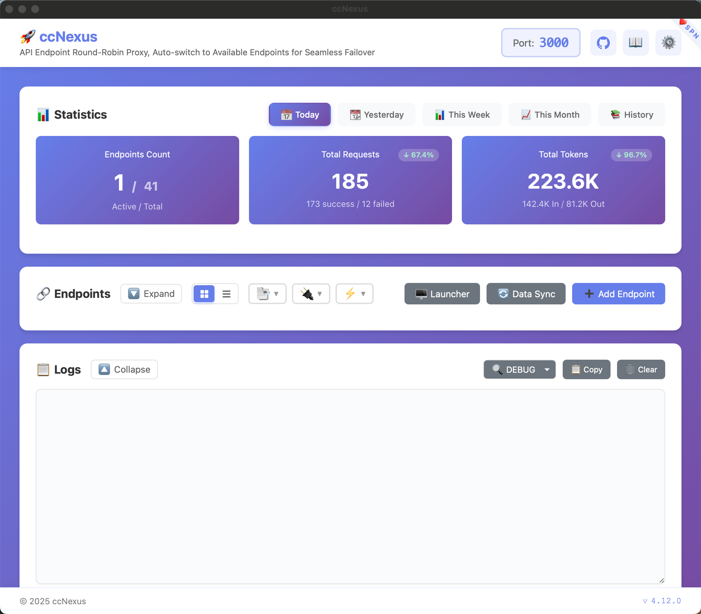
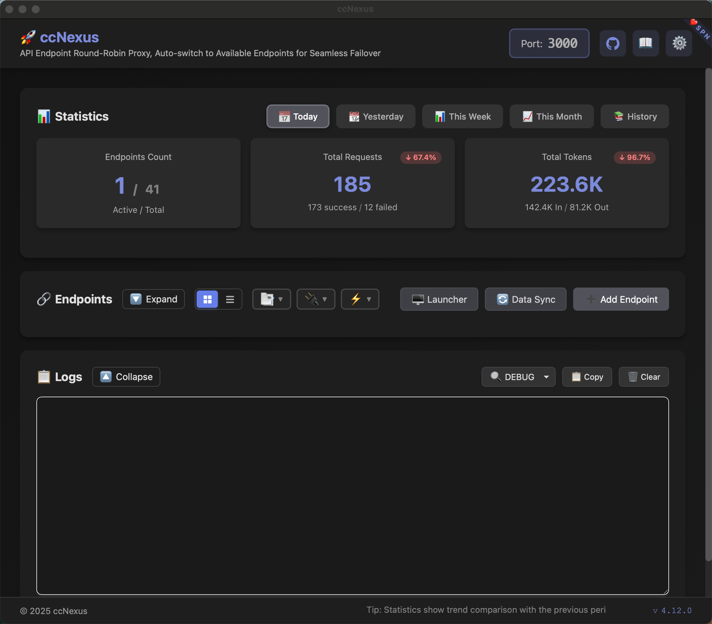

# ccNexus

<div align="center">

**Smart API endpoint rotation proxy for Claude Code**

[](https://github.com/lich0821/ccNexus/actions)
[](https://opensource.org/licenses/MIT)
[](https://go.dev/)
[](https://wails.io/)

[English](README.md) | [简体中文](README_CN.md)

</div>

## 📖 Introduction

ccNexus is a smart API endpoint rotation proxy designed for Claude Code. It helps you manage multiple API endpoints with automatic failover, load balancing, and supports converting Claude API requests to OpenAI or Gemini formats.

### Why ccNexus?

- **Multi-endpoint Management**: Configure multiple API endpoints, automatically switch when one fails
- **API Format Conversion**: Support Claude, OpenAI, and Gemini API format conversion
- **Usage Statistics**: Real-time monitoring of requests, errors, and token usage
- **Data Security**: All data stored locally, safe and secure

## 📸 Application Interface

<table>
  <tr>
    <td align="center"></td>
    <td align="center"></td>
  </tr>
  <tr>
    <td align="center">Light Theme</td>
    <td align="center">Dark Theme</td>
  </tr>
</table>

## 📖 Help

<table>
  <tr>
    <td align="center"></td>
    <td align="center"></td>
  </tr>
  <tr>
    <td align="center">Please join the group for problem feedback</td>
    <td align="center">If the group chat expires, please add as friend to join</td>
  </tr>
</table>

## ✨ Features

### Core Features

| Feature | Description |
|---------|-------------|
| 🔄 **Auto Endpoint Rotation** | Automatically switch to next available endpoint on failure |
| 🔀 **Multi-Format Support** | Support Claude, OpenAI, and Gemini API format conversion |
| 🔁 **Smart Retry** | Auto retry failed requests, up to `endpoints × 2` attempts |
| 📊 **Real-time Stats** | Monitor requests, errors, and token usage |
| 📈 **Historical Data** | SQLite-based statistics with monthly archives |
| ☁️ **WebDAV Sync** | Sync configuration and stats across devices via WebDAV |

### UI Features

| Feature | Description |
|---------|-------------|
| 🖥️ **Cross-platform Desktop App** | Support Windows, macOS, Linux |
| 🎨 **Multiple Themes** | 12 themes: Light, Dark, Green, Starry, Sakura, Sunset, Ocean, Mocha, Cyberpunk, Aurora, Holographic, Quantum |
| 🌙 **Auto Theme Switch** | Automatically switch between light/dark themes by time (7:00-19:00 light) |
| 🌐 **Bilingual Interface** | Support Chinese and English |
| 📋 **System Tray** | Minimize to system tray |
| 📝 **Real-time Logs** | View proxy logs with level filtering |

## 🚀 Quick Start

### Download

[📥 Download Latest Release](https://github.com/lich0821/ccNexus/releases/latest)

#### Windows
1. Download `ccNexus-windows-amd64.zip`
2. Extract to any directory
3. Run `ccNexus.exe`

#### macOS
1. Download `ccNexus-darwin-amd64.zip` or `ccNexus-darwin-arm64.zip` (Apple Silicon)
2. Extract and move `ccNexus.app` to Applications folder
3. First run: Right-click → Open (bypass Gatekeeper)

#### Linux
```bash
tar -xzf ccNexus-linux-amd64.tar.gz
./ccNexus
```

### Setup

#### 1. Add API Endpoint

Click "Add Endpoint" button and fill in:

| Field | Description | Example |
|-------|-------------|---------|
| **Name** | Friendly name for the endpoint | `Claude Official` |
| **API URL** | API server address | `https://api.anthropic.com` |
| **API Key** | Your API key | `sk-ant-api03-...` |
| **Transformer** | API format type | `claude` / `openai` / `gemini` |
| **Model** | Target model (required for non-Claude) | `gpt-4-turbo` / `gemini-pro` |
| **Remark** | Optional notes | `Primary endpoint` |

#### 2. Configure Claude Code

Set the following in Claude Code's settings.json file (default in user's home directory):

```
API Base URL: http://localhost:3000
API Key: Any value (proxy uses endpoint's configured key)
```

#### 3. Start Using

After configuration, all Claude Code requests will be proxied through ccNexus to your configured endpoints.

## 📖 How It Works

```
┌─────────────┐     ┌─────────────────────────────────────────────────┐
│ Claude Code │────▶│              ccNexus Proxy                       │
└─────────────┘     │  localhost:3000                                  │
                    │                                                  │
                    │  ┌─────────────┐   Fail     ┌─────────────┐     │
                    │  │ Endpoint #1 │──────────▶│ Endpoint #2 │     │
                    │  │  (Claude)   │           │  (OpenAI)   │     │
                    │  └─────────────┘           └─────────────┘     │
                    │         │                         │             │
                    │         │ Success                 │ Success     │
                    │         ▼                         ▼             │
                    │  ┌─────────────────────────────────────┐        │
                    │  │      Return response to Claude Code  │        │
                    │  └─────────────────────────────────────┘        │
                    └─────────────────────────────────────────────────┘
```

**Workflow:**
1. Claude Code sends request to local proxy (default port 3000)
2. Proxy tries enabled endpoints in order
3. If current endpoint fails, automatically switch to next endpoint
4. Auto-convert request/response format based on endpoint's transformer
5. Return successful response to Claude Code

## 🔧 Configuration

### Application Settings

| Setting | Description | Default |
|---------|-------------|---------|
| **Proxy Port** | Local proxy listening port | `3000` |
| **Log Level** | 0=DEBUG, 1=INFO, 2=WARN, 3=ERROR | `1` (INFO) |
| **Language** | Chinese / English | `zh-CN` |
| **Theme** | 12 themes available | `light` |
| **Auto Theme** | Auto switch theme by time | Off |
| **Close Behavior** | Quit / Minimize to tray / Ask | Ask |

### Endpoint Configuration

#### Transformer Types

| Transformer | Description | Model Field |
|-------------|-------------|-------------|
| `claude` | Claude native API (passthrough) | Optional (override request model) |
| `openai` | OpenAI compatible API | **Required** (e.g., `gpt-4-turbo`) |
| `gemini` | Google Gemini API | **Required** (e.g., `gemini-pro`) |

#### Configuration Examples

**Claude Official Endpoint:**
```json
{
  "name": "Claude Official",
  "apiUrl": "https://api.anthropic.com",
  "apiKey": "sk-ant-api03-xxx",
  "enabled": true,
  "transformer": "claude"
}
```

**OpenAI Compatible Endpoint:**
```json
{
  "name": "OpenAI Proxy",
  "apiUrl": "https://api.openai.com",
  "apiKey": "sk-xxx",
  "enabled": true,
  "transformer": "openai",
  "model": "gpt-4-turbo"
}
```

**Gemini Endpoint:**
```json
{
  "name": "Gemini",
  "apiUrl": "https://generativelanguage.googleapis.com",
  "apiKey": "AIza-xxx",
  "enabled": true,
  "transformer": "gemini",
  "model": "gemini-pro"
}
```

### WebDAV Cloud Sync

ccNexus supports syncing configuration and statistics via WebDAV protocol, compatible with:
- Nutstore (坚果云)
- NextCloud
- ownCloud
- Other standard WebDAV services

**Setup Steps:**
1. Click "WebDAV Cloud Backup" in the interface
2. Enter WebDAV server URL, username, and password
3. Click "Test Connection" to verify
4. Use "Backup" and "Restore" to manage data

## 📊 Statistics

### Time Ranges

| Range | Description |
|-------|-------------|
| **Today** | Current day statistics |
| **Yesterday** | Previous day statistics |
| **Weekly** | Current week cumulative |
| **Monthly** | Current month cumulative |
| **History** | View monthly archives |

### Metrics

- **Requests**: Total successful and failed requests
- **Errors**: Number of failed requests
- **Tokens**: Input and output token usage (estimated)
- **Success Rate**: Percentage of successful requests

## 🛠️ Development

### 1. Environment Setup

#### Install Go

1. Download Go 1.22+ from [Go official website](https://go.dev/dl/)
2. Verify installation:
```bash
go version
# Example output: go version go1.22.0 windows/amd64
```

#### Install Node.js

1. Download LTS version (18+) from [Node.js official website](https://nodejs.org/)
2. Verify installation:
```bash
node -v
# Example output: v18.19.0

npm -v
# Example output: 10.2.3
```

#### Install Wails CLI

```bash
go install github.com/wailsapp/wails/v2/cmd/wails@latest
```

Verify installation:
```bash
wails version
# Example output: v2.10.1
```

Check development dependencies:
```bash
wails doctor
```
> Follow the prompts from `wails doctor` to install missing dependencies (e.g., WebView2 for Windows, GTK3 for Linux)

### 2. Clone Repository

```bash
git clone https://github.com/lich0821/ccNexus.git
cd ccNexus
```

### 3. Development Mode

```bash
# Auto-install dependencies and start dev mode
node run.mjs
```

Or manually:
```bash
# Install frontend dependencies
cd frontend && npm install && cd ..

# Start dev mode (with hot reload)
wails dev
```

### 4. Build

```bash
# Build for current platform
npm run build

# Optimized build (production)
npm run build:prod

# Platform-specific builds
npm run build:windows    # Windows
npm run build:macos      # macOS
npm run build:linux      # Linux
```

Build output is located in `build/bin/` directory.

### Project Structure

```
ccNexus/
├── main.go                    # Application entry
├── app.go                     # Core application logic
├── wails.json                 # Wails configuration
│
├── internal/                  # Go backend modules
│   ├── proxy/                 # HTTP proxy core
│   │   ├── proxy.go          # Proxy server
│   │   ├── handler.go        # Request handling
│   │   ├── streaming.go      # SSE streaming
│   │   └── stats.go          # Statistics recording
│   ├── transformer/           # API format converters
│   │   ├── claude/           # Claude API
│   │   ├── openai/           # OpenAI API
│   │   └── gemini/           # Gemini API
│   ├── storage/               # SQLite data storage
│   ├── config/                # Configuration management
│   ├── webdav/                # WebDAV sync
│   ├── logger/                # Logging system
│   └── tray/                  # System tray
│
└── frontend/                  # Frontend code
    ├── src/
    │   ├── modules/          # Feature modules
    │   ├── i18n/             # Internationalization
    │   └── themes/           # Theme styles
    └── wailsjs/              # Wails bindings
```

## ❓ FAQ

### Installation & Startup

**Q: Windows shows "Windows protected your PC" warning?**

A: Click "More info" → "Run anyway". This is because the app is not digitally signed.

**Q: macOS shows "Cannot be opened because the developer cannot be verified"?**

A: Right-click the app → Select "Open" → Click "Open" in the dialog. Or allow in "System Preferences" → "Security & Privacy".

**Q: Port is already in use?**

A: Click the port number at the top of the interface, change to another available port (e.g., 3001), then restart the app.

### Endpoint Configuration

**Q: How to choose the right transformer?**

A:
- Using Claude official API or Claude-compatible services → Select `claude`
- Using OpenAI API or OpenAI-compatible services → Select `openai`
- Using Google Gemini API → Select `gemini`

**Q: Why is the model field required for OpenAI/Gemini?**

A: Because Claude Code sends requests with Claude model names, the proxy needs to know which target API model to convert to.

**Q: Endpoint test succeeds but actual use fails?**

A: The test only verifies connectivity. Actual use may fail due to:
- Insufficient API key permissions
- Incorrect model name
- API quota exhausted
- Check logs for detailed error information

### Usage

**Q: How to view request logs?**

A: Click the "Logs" area at the bottom of the interface to expand. Supports filtering by level (Debug/Info/Warn/Error).

**Q: Are token statistics accurate?**

A: Token counts are estimates based on text length and may differ from actual billing. For reference only.

**Q: How to backup configuration?**

A: Two methods:
1. Use WebDAV cloud sync feature
2. Manually copy `~/.ccNexus/ccnexus.db` file

**Q: What's the rotation order for multiple endpoints?**

A: Endpoints rotate in list order. You can drag to reorder endpoints.

### Other

**Q: Where is data stored? Is it secure?**

A: All data is stored locally in `~/.ccNexus/` directory. API keys are never sent to any third-party services.

**Q: Which operating systems are supported?**

A: Windows 10+, macOS 10.15+, Linux (requires GTK3).

**Q: How to update to a new version?**

A: Download the new version and overwrite install. Configuration data is automatically preserved.

## 📄 License

This project is open source under the [MIT License](LICENSE).

---

<div align="center">
Made with ❤️ by Chuck
</div>
