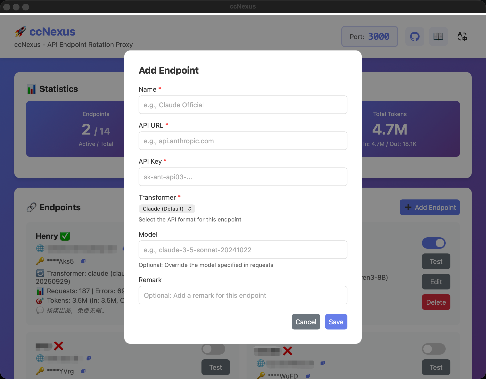

# ccNexus (Claude Code Nexus)

<div align="center">

**A smart API endpoint rotation proxy for Claude Code**

[](https://github.com/lich0821/ccNexus/actions)
[](https://opensource.org/licenses/MIT)
[](https://go.dev/)
[](https://wails.io/)

[English](README.md) | [简体中文](README_CN.md)

</div>

## 📸 Screenshot



## ✨ Features

- 🔄 **Automatic Endpoint Rotation** - Seamlessly switches between endpoints on errors
- 🌐 **Multi-Provider Support** - Use official Claude API and third-party providers
- 🔀 **Multi-Format Transformer** - Support Claude, OpenAI, and Gemini API formats
- 🔁 **Smart Retry** - Retries on any non-200 response
- 📊 **Real-time Statistics** - Monitor requests, errors, and endpoint usage
- 💰 **Token Usage Tracking** - Track input/output tokens for each endpoint
- 🎯 **Endpoint Management** - Enable/disable endpoints with toggle switches
- 🔐 **Secure API Key Display** - Shows only last 4 characters of API keys
- 🚦 **Smart Load Balancing** - Distributes requests only to enabled endpoints
- 📋 **Comprehensive Logging** - Multi-level logging (DEBUG/INFO/WARN/ERROR) with real-time viewing
- 📈 **Historical Statistics** - View monthly archived statistics with SQLite storage
- 🖥️ **Desktop GUI** - Beautiful cross-platform interface built with Wails
- 🚀 **Single Binary** - No dependencies, just download and run
- 🔧 **Easy Configuration** - Manage endpoints through GUI or config file
- 💾 **Persistent Storage** - SQLite database for configuration and statistics
- 🔄 **Auto Migration** - Seamlessly migrates from JSON to SQLite on first run
- 🔒 **Local First** - All data stays on your machine

## 🚀 Quick Start

### Download

Download the latest release for your platform:

- **Windows**: `ccNexus-windows-amd64.zip`
- **macOS (Intel)**: `ccNexus-darwin-amd64.zip`
- **macOS (Apple Silicon)**: `ccNexus-darwin-arm64.zip`
- **Linux**: `ccNexus-linux-amd64.tar.gz`

[📥 Download Latest Release](https://github.com/lich0821/ccNexus/releases/latest)

### Installation

#### Windows

1. Extract the ZIP file
2. Double-click `ccNexus.exe`
3. The application will start with a default configuration

#### macOS

1. Extract the ZIP file
2. Move `ccNexus.app` to Applications folder
3. Right-click and select "Open" (first time only)
4. The application will start with a default configuration

#### Linux

```bash
tar -xzf ccNexus-linux-amd64.tar.gz
chmod +x ccNexus
./ccNexus
```

### Configuration

1. **Add Endpoints**: Click "Add Endpoint" button
2. **Fill in Details**:
   - Name: A friendly name (e.g., "Claude Official")
   - API URL: The API server address (e.g., `api.anthropic.com`)
   - API Key: Your API key
   - Transformer: Select API format (Claude/OpenAI/Gemini)
   - Model: Required for OpenAI and Gemini (e.g., `gpt-4-turbo`, `gemini-pro`)
3. **Save**: Click "Save" to add the endpoint

### Configure Claude Code

In Claude Code settings:
- **API Base URL**: `http://localhost:3000`
- **API Key**: Any value (will be replaced by proxy)

## 📖 How It Works

```
Claude Code → Proxy (localhost:3000) → Endpoint #1 (non-200 response)
                                     → Endpoint #2 (success) ✅
```

1. **Request Interception**: Proxy receives all API requests
2. **Endpoint Selection**: Uses current available endpoint
3. **Error Detection**: Monitors response status codes
4. **Auto Retry**: Switches endpoint and retries on non-200 responses
5. **Round Robin**: Cycles through all endpoints

## 🔧 Configuration and Data Storage

Data is stored at:
- **Windows**: `%USERPROFILE%\.ccNexus\`
- **macOS/Linux**: `~/.ccNexus/`

Files:
- `config.json` - Legacy configuration (auto-migrated to SQLite on first run)
- `ccnexus.db` - SQLite database (configuration and statistics)
- `backup/` - Backup of legacy JSON files after migration

Example:

```json
{
  "port": 3000,
  "logLevel": 1,
  "endpoints": [
    {
      "name": "Claude Official 1",
      "apiUrl": "api.anthropic.com",
      "apiKey": "sk-ant-api03-your-key-1",
      "transformer": "claude",
      "enabled": true
    },
    {
      "name": "OpenAI Compatible",
      "apiUrl": "api.openai.com",
      "apiKey": "sk-your-openai-key",
      "transformer": "openai",
      "model": "gpt-4-turbo",
      "enabled": true
    },
    {
      "name": "Google Gemini",
      "apiUrl": "generativelanguage.googleapis.com",
      "apiKey": "your-gemini-key",
      "transformer": "gemini",
      "model": "gemini-pro",
      "enabled": true
    }
  ]
}
```

**Configuration Fields:**
- `port`: Proxy server port (default: 3000)
- `logLevel`: Logging level - 0=DEBUG, 1=INFO, 2=WARN, 3=ERROR (default: 1)
- `endpoints`: Array of API endpoints
  - `name`: Friendly name for the endpoint
  - `apiUrl`: API server address
  - `apiKey`: API authentication key
  - `transformer`: API format - "claude" (default), "openai", or "gemini"
  - `model`: Model name (required for OpenAI and Gemini transformers)
  - `enabled`: Whether the endpoint is active

## 🛠️ Development

### Prerequisites

- Go 1.22+
- Node.js 18+
- Wails CLI v2 (will be auto-installed if not present)

### Quick Start

The project includes a smart `run.mjs` script that automatically handles dependencies and setup:

```bash
# Clone repository
git clone https://github.com/lich0821/ccNexus.git
cd ccNexus

# Run in development mode (auto-installs Wails if needed)
node run.mjs

# Or use npm
npm start
# or
npm run dev
```

**Features of run.mjs:**
- ✅ Auto-installs Wails CLI if not found
- ✅ Auto-installs frontend dependencies
- ✅ Uses China mirrors for faster downloads (GOPROXY, npm registry)
- ✅ Simple command-line interface

### Manual Setup (Alternative)

```bash
# Install Wails manually
go install github.com/wailsapp/wails/v2/cmd/wails@latest

# Install dependencies
go mod download
cd frontend && npm install && cd ..

# Run in development mode
wails dev
```

### Build

```bash
# Standard build
node run.mjs -b
# or
npm run build

# Production build (optimized + compressed)
node run.mjs -b -p
# or
npm run build:prod

# Build for specific platform
node run.mjs -b --platform windows/amd64
node run.mjs -b --platform darwin/universal
node run.mjs -b --platform linux/amd64

# Or use npm scripts
npm run build:windows
npm run build:macos
npm run build:linux
```

### Script Options

```bash
node run.mjs              # Development mode (default)
node run.mjs -b           # Build mode
node run.mjs -b -p        # Production build (optimized)
node run.mjs --help       # Show help
```

## 📚 Project Structure

```
ccNexus/
├── main.go                 # Application entry point
├── app.go                  # Wails app logic
├── internal/
│   ├── proxy/             # Proxy core logic
│   │   ├── proxy.go       # HTTP proxy with retry
│   │   └── stats.go       # Statistics tracking
│   ├── config/            # Configuration management
│   │   └── config.go      # Config structure
│   ├── storage/           # Data persistence layer
│   │   ├── interface.go   # Storage interface
│   │   ├── sqlite.go      # SQLite implementation
│   │   ├── migration.go   # JSON to SQLite migration
│   │   ├── legacy.go      # Legacy JSON support
│   │   ├── adapter.go     # Config storage adapter
│   │   └── stats_adapter.go # Stats storage adapter
│   ├── transformer/       # API format transformers
│   │   ├── transformer.go # Transformer interface
│   │   ├── claude.go      # Claude API format
│   │   ├── openai.go      # OpenAI API format
│   │   ├── gemini.go      # Gemini API format
│   │   ├── types.go       # Common types
│   │   └── registry.go    # Transformer registry
│   └── logger/            # Logging system
│       └── logger.go      # Multi-level logger
├── frontend/              # Frontend UI
│   ├── index.html
│   └── src/
│       ├── main.js        # UI logic
│       └── style.css      # Styles
└── .github/workflows/
    └── build.yml          # CI/CD pipeline
```

## ❓ FAQ

### Q: Proxy won't start?

**A**: Check if port is in use:
```bash
# macOS/Linux
lsof -i :3000

# Windows
netstat -ano | findstr :3000
```

### Q: Claude Code can't connect?

**A**: Verify:
1. Proxy application is running
2. Claude Code Base URL is `http://localhost:3000`
3. Firewall isn't blocking the connection

### Q: Endpoint switching not working?

**A**: Check:
1. Multiple endpoints are configured
2. API keys are valid
3. View application logs for switching behavior

### Q: How to view detailed logs?

**A**:
- **Built-in Log Panel**: Use the Logs section in the application UI
  - Select log level: DEBUG, INFO, WARN, or ERROR
  - Auto-refreshes every 2 seconds
  - Copy logs with one click
  - Shows last 100 log entries
- **Console Output**:
  - **macOS/Linux**: Run app from terminal to see real-time logs
  - **Windows**: Logs are displayed in the built-in log panel
  - **Advanced**: Use `./ccNexus 2>&1 | tee ccNexus.log` to save logs to file

### Q: What do the log levels mean?

**A**:
- **DEBUG** (🔍): Detailed information for debugging (request URLs, token counts, etc.)
- **INFO** (ℹ️): General information (endpoint switches, configuration changes)
- **WARN** (⚠️): Warning messages (HTTP errors, retry attempts)
- **ERROR** (❌): Error messages (critical failures, connection issues)

## 🤝 Contributing

Contributions are welcome! Please feel free to submit a Pull Request.

## 📝 License

This project is licensed under the MIT License - see the [LICENSE](LICENSE) file for details.

## 🙏 Acknowledgments

- [Wails](https://wails.io/) - Amazing Go + Web framework
- [Anthropic](https://www.anthropic.com/) - Claude Code
- All contributors and users

## 📞 Support

- 🐛 [Report Bug](https://github.com/lich0821/ccNexus/issues/new)
- 💡 [Request Feature](https://github.com/lich0821/ccNexus/issues/new)
- 💬 [Discussions](https://github.com/lich0821/ccNexus/discussions)

---

<div align="center">
Made with ❤️ by Chuck
</div>
