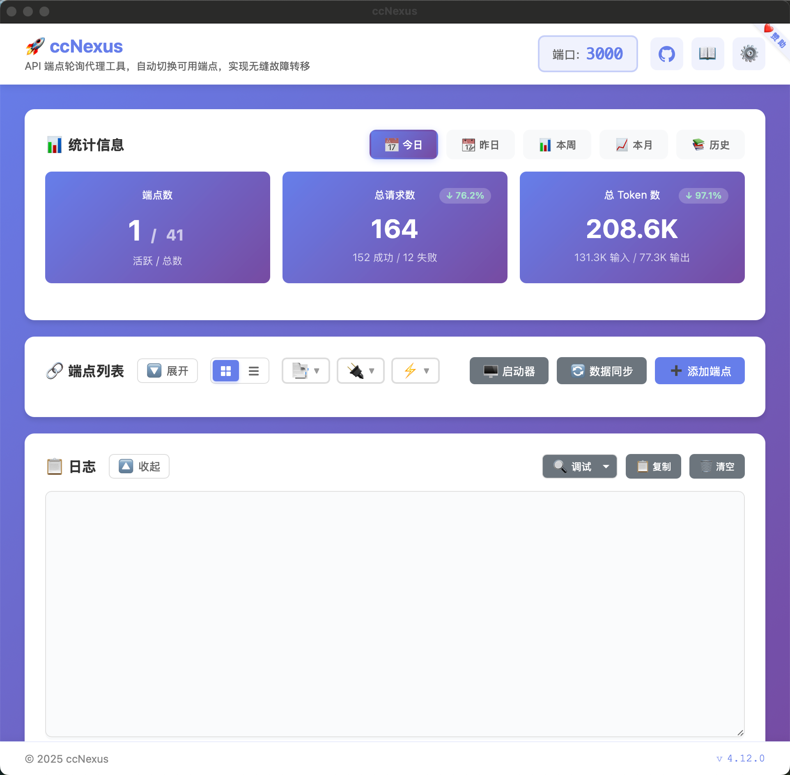
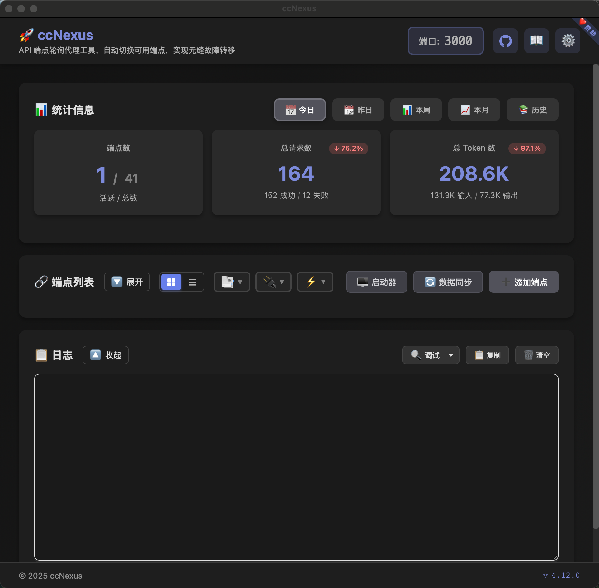

# ccNexus

<div align="center">

**Claude Code 智能端点轮换代理**

[](https://github.com/lich0821/ccNexus/actions)
[](https://opensource.org/licenses/MIT)
[](https://go.dev/)
[](https://wails.io/)

[English](README.md) | [简体中文](README_CN.md)

</div>

## 📸 截图

<p align="center">
  
  
</p>

## ✨ 功能特性

- 🔄 **自动端点轮换** - 错误时无缝故障转移
- 🔀 **多格式支持** - Claude、OpenAI 和 Gemini API 格式
- 🔁 **智能重试** - 自动重试并切换端点
- 📊 **实时统计** - 监控请求、错误和 Token 使用
- 📈 **历史数据** - 基于 SQLite 的月度统计归档
- 🖥️ **桌面 GUI** - 跨平台界面，支持明暗主题
- 🚀 **单文件分发** - 无需依赖
- 🔒 **本地优先** - 所有数据保存在本地

## 🚀 快速开始

[📥 下载最新版本](https://github.com/lich0821/ccNexus/releases/latest)

### 安装

**Windows**: 解压 ZIP 并运行 `ccNexus.exe`
**macOS**: 解压 ZIP，移至应用程序文件夹，右键 → 打开
**Linux**: `tar -xzf ccNexus-linux-amd64.tar.gz && ./ccNexus`

### 配置

1. 点击"Add Endpoint"并配置：
   - **Name**: 友好名称
   - **API URL**: 如 `api.anthropic.com`
   - **API Key**: 您的 API 密钥
   - **Transformer**: Claude/OpenAI/Gemini
   - **Model**: OpenAI/Gemini 必填（如 `gpt-4-turbo`）

2. 配置 Claude Code：
   - **API Base URL**: `http://localhost:3000`
   - **API Key**: 任意值

## 📖 工作原理

```
Claude Code → 代理 (localhost:3000) → 端点 #1 (失败) → 端点 #2 (成功) ✅
```

代理拦截请求，通过轮询机制转发到已启用的端点，失败时自动重试。

## 🔧 配置

**数据位置**: `~/.ccNexus/` (Windows: `%USERPROFILE%\.ccNexus\`)

**文件**:
- `ccnexus.db` - SQLite 数据库（配置 + 统计）
- `config.json` - 旧版配置（首次运行时自动迁移）

**设置**:
- `port`: 代理端口（默认：3000）
- `logLevel`: 0=DEBUG, 1=INFO, 2=WARN, 3=ERROR

## 🛠️ 开发

**前置要求**: Go 1.22+, Node.js 18+

```bash
# 克隆并运行
git clone https://github.com/lich0821/ccNexus.git
cd ccNexus
node run.mjs  # 自动安装 Wails CLI 和依赖

# 构建
npm run build              # 当前平台
npm run build:prod         # 优化构建
npm run build:windows      # Windows
npm run build:macos        # macOS
npm run build:linux        # Linux
```

## 📚 架构

```
ccNexus/
├── main.go & app.go           # 应用入口
├── internal/
│   ├── proxy/                 # HTTP 代理与重试逻辑
│   ├── storage/               # SQLite 持久化 + 迁移
│   ├── transformer/           # API 格式转换器（Claude/OpenAI/Gemini）
│   ├── config/                # 配置管理
│   └── logger/                # 多级日志
└── frontend/                  # 原生 JS UI
```
