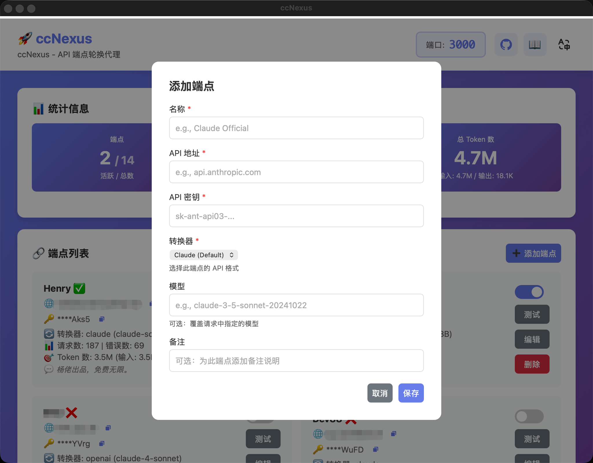

# ccNexus (Claude Code Nexus)

<div align="center">

**Claude Code 智能端点轮换代理**

[](https://github.com/lich0821/ccNexus/actions)
[](https://opensource.org/licenses/MIT)
[](https://go.dev/)
[](https://wails.io/)

[English](README.md) | [简体中文](README_CN.md)

</div>

## 📸 截图



## ✨ 功能特性

- 🔄 **自动端点切换** - 遇到错误时无缝切换端点
- 🌐 **多供应商支持** - 支持 Claude 官方 API 和第三方供应商
- 🔀 **多格式转换器** - 支持 Claude、OpenAI 和 Gemini API 格式
- 🔁 **智能重试** - 对所有非 200 响应自动重试
- 📊 **实时统计** - 监控请求、错误和端点使用情况
- 💰 **Token 使用追踪** - 追踪每个端点的输入 / 输出 Token 消耗
- 🎯 **端点管理** - 使用开关按钮启用 / 禁用端点
- 🔐 **安全的 API Key 显示** - 仅显示 API Key 的后 4 位
- 🚦 **智能负载均衡** - 仅向启用的端点分发请求
- 📋 **完善的日志系统** - 多级日志（DEBUG/INFO/WARN/ERROR）实时查看
- 📈 **历史统计** - 查看按月归档的历史统计数据，基于 SQLite 存储
- 🖥️ **桌面 GUI** - 基于 Wails 的精美跨平台界面
- 🚀 **单文件分发** - 无需依赖，下载即用
- 🔧 **简单配置** - 通过 GUI 或配置文件管理端点
- 💾 **持久化存储** - SQLite 数据库存储配置和统计数据
- 🔄 **自动迁移** - 首次运行时自动从 JSON 迁移到 SQLite
- 🔒 **本地优先** - 所有数据保存在本地

## 🚀 快速开始

### 下载

下载适合您平台的最新版本：

- **Windows**: `ccNexus-windows-amd64.zip`
- **macOS (Intel)**: `ccNexus-darwin-amd64.zip`
- **macOS (Apple Silicon)**: `ccNexus-darwin-arm64.zip`
- **Linux**: `ccNexus-linux-amd64.tar.gz`

[📥 下载最新版本](https://github.com/lich0821/ccNexus/releases/latest)

### 安装

#### Windows

1. 解压 ZIP 文件
2. 双击 `ccNexus.exe`
3. 应用程序将使用默认配置启动

#### macOS

1. 解压 ZIP 文件
2. 将 `ccNexus.app` 移动到应用程序文件夹
3. 右键点击并选择"打开"（仅首次需要）
4. 应用程序将使用默认配置启动

#### Linux

```bash
tar -xzf ccNexus-linux-amd64.tar.gz
chmod +x ccNexus
./ccNexus
```

### 配置

1. **添加端点**：点击"Add Endpoint"按钮
2. **填写详情**：
   - Name: 友好名称（如"Claude Official"）
   - API URL: API 服务器地址（如 `api.anthropic.com`）
   - API Key: 您的 API 密钥
   - Transformer: 选择 API 格式（Claude/OpenAI/Gemini）
   - Model: OpenAI 和 Gemini 必填（如 `gpt-4-turbo`、`gemini-pro`）
3. **保存**：点击"Save"添加端点

### 配置 Claude Code

在 Claude Code 设置中：
- **API Base URL**: `http://localhost:3000`
- **API Key**: 任意值（会被代理替换）

## 📖 工作原理

```
Claude Code → 代理 (localhost:3000) → 端点 #1 (非 200 响应)
                                    → 端点 #2 (成功) ✅
```

1. **请求拦截**：代理接收所有 API 请求
2. **端点选择**：使用当前可用端点
3. **错误检测**：监控响应状态码
4. **自动重试**：遇到非 200 响应时切换端点并重试
5. **轮询机制**：循环使用所有端点

## 🔧 配置和数据存储

数据存储位置：
- **Windows**: `%USERPROFILE%\.ccNexus\`
- **macOS/Linux**: `~/.ccNexus/`

文件说明：
- `config.json` - 旧版配置文件（首次运行时自动迁移到 SQLite）
- `ccnexus.db` - SQLite 数据库（配置和统计数据）
- `backup/` - 迁移后的旧版 JSON 文件备份

示例：

```json
{
  "port": 3000,
  "logLevel": 1,
  "endpoints": [
    {
      "name": "Claude Official 1",
      "apiUrl": "api.anthropic.com",
      "apiKey": "sk-ant-api03-your-key-1",
      "transformer": "claude",
      "enabled": true
    },
    {
      "name": "OpenAI 兼容",
      "apiUrl": "api.openai.com",
      "apiKey": "sk-your-openai-key",
      "transformer": "openai",
      "model": "gpt-4-turbo",
      "enabled": true
    },
    {
      "name": "Google Gemini",
      "apiUrl": "generativelanguage.googleapis.com",
      "apiKey": "your-gemini-key",
      "transformer": "gemini",
      "model": "gemini-pro",
      "enabled": true
    }
  ]
}
```

**配置字段说明：**
- `port`：代理服务器端口（默认：3000）
- `logLevel`：日志级别 - 0=DEBUG, 1=INFO, 2=WARN, 3=ERROR（默认：1）
- `endpoints`：API 端点数组
  - `name`：端点的友好名称
  - `apiUrl`：API 服务器地址
  - `apiKey`：API 认证密钥
  - `transformer`：API 格式 - "claude"（默认）、"openai" 或 "gemini"
  - `model`：模型名称（OpenAI 和 Gemini 转换器必填）
  - `enabled`：端点是否启用

## 🛠️ 开发

### 前置要求

- Go 1.22+
- Node.js 18+
- Wails CLI v2（若未安装会自动安装）

### 快速开始

项目包含智能 `run.mjs` 脚本，自动处理依赖和设置：

```bash
# 克隆仓库
git clone https://github.com/lich0821/ccNexus.git
cd ccNexus

# 开发模式运行（自动安装 Wails）
node run.mjs

# 或使用 npm
npm start
# 或
npm run dev
```

**run.mjs 特性：**
- ✅ 自动安装 Wails CLI（如未找到）
- ✅ 自动安装前端依赖
- ✅ 使用国内镜像加速下载（GOPROXY、npm 镜像）
- ✅ 简洁的命令行界面

### 手动设置（备选方案）

```bash
# 手动安装 Wails
go install github.com/wailsapp/wails/v2/cmd/wails@latest

# 安装依赖
go mod download
cd frontend && npm install && cd ..

# 开发模式运行
wails dev
```

### 构建

```bash
# 标准构建
node run.mjs -b
# 或
npm run build

# 生产构建（优化+压缩）
node run.mjs -b -p
# 或
npm run build:prod

# 构建特定平台
node run.mjs -b --platform windows/amd64
node run.mjs -b --platform darwin/universal
node run.mjs -b --platform linux/amd64

# 或使用 npm 脚本
npm run build:windows
npm run build:macos
npm run build:linux
```

### 脚本选项

```bash
node run.mjs              # 开发模式（默认）
node run.mjs -b           # 构建模式
node run.mjs -b -p        # 生产构建（优化）
node run.mjs --help       # 显示帮助
```

## 📚 项目结构

```
ccNexus/
├── main.go                 # 应用入口
├── app.go                  # Wails 应用逻辑
├── internal/
│   ├── proxy/             # 代理核心逻辑
│   │   ├── proxy.go       # HTTP 代理与重试
│   │   └── stats.go       # 统计追踪
│   ├── config/            # 配置管理
│   │   └── config.go      # 配置结构
│   ├── storage/           # 数据持久化层
│   │   ├── interface.go   # 存储接口
│   │   ├── sqlite.go      # SQLite 实现
│   │   ├── migration.go   # JSON 到 SQLite 迁移
│   │   ├── legacy.go      # 旧版 JSON 支持
│   │   ├── adapter.go     # 配置存储适配器
│   │   └── stats_adapter.go # 统计存储适配器
│   ├── transformer/       # API 格式转换器
│   │   ├── transformer.go # 转换器接口
│   │   ├── claude.go      # Claude API 格式
│   │   ├── openai.go      # OpenAI API 格式
│   │   ├── gemini.go      # Gemini API 格式
│   │   ├── types.go       # 通用类型
│   │   └── registry.go    # 转换器注册表
│   └── logger/            # 日志系统
│       └── logger.go      # 多级日志记录器
├── frontend/              # 前端 UI
│   ├── index.html
│   └── src/
│       ├── main.js        # UI 逻辑
│       └── style.css      # 样式
└── .github/workflows/
    └── build.yml          # CI/CD 流水线
```

## ❓ 常见问题
[FAQ](https://mp.weixin.qq.com/s/ohtkyIMd5YC7So1q-gE0og)

## 🤝 贡献

欢迎贡献！请随时提交 Pull Request。

## 📝 许可证

本项目采用 MIT 许可证 - 详见 [LICENSE](LICENSE) 文件。

## 🙏 致谢

- [Wails](https://wails.io/) - 出色的 Go + Web 框架
- [Anthropic](https://www.anthropic.com/) - Claude Code
- 所有贡献者和用户

## 📞 支持

- 🐛 [报告 Bug](https://github.com/lich0821/ccNexus/issues/new)
- 💡 [功能请求](https://github.com/lich0821/ccNexus/issues/new)
- 💬 [讨论区](https://github.com/lich0821/ccNexus/discussions)

---

<div align="center">
查克用 ❤️ 制作
</div>
